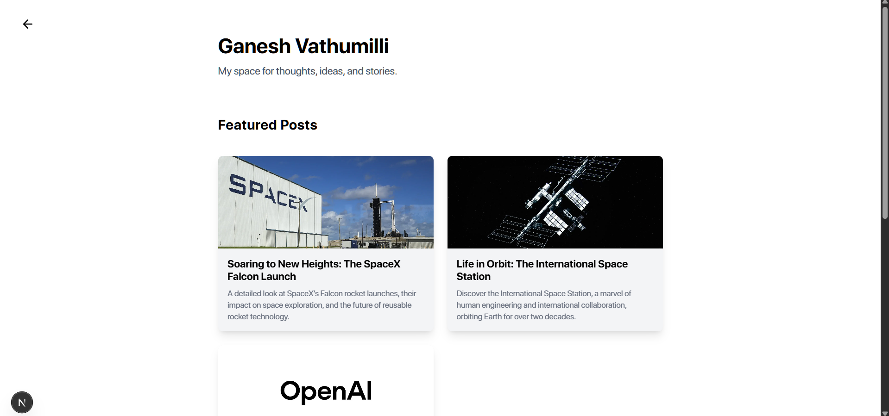
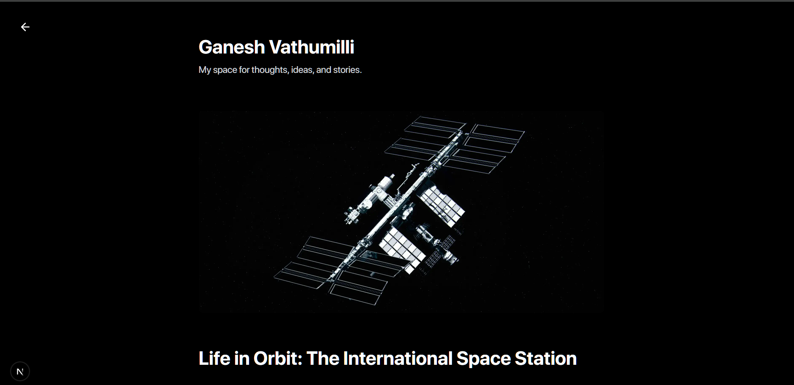
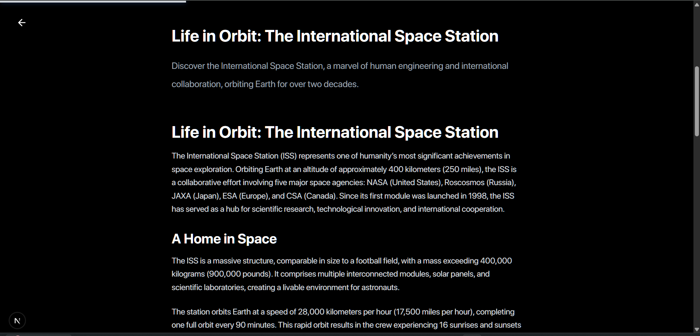
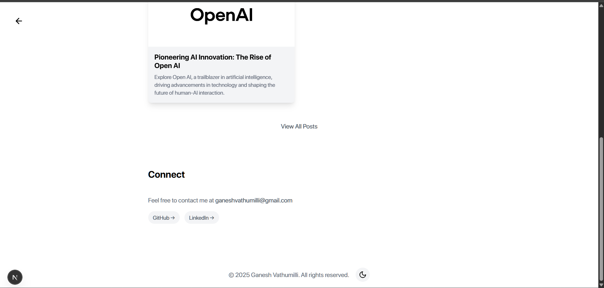

# My Personal Blog

A modern, responsive blog built with Next.js 15, featuring a beautiful dark/light theme toggle and markdown-based content management.




## Features

- 🌓 Dynamic Dark/Light Theme Toggle
- 📱 Fully Responsive Design
- ⚡ Fast Page Loads with Next.js
- 📝 Markdown-based Blog Posts
- 🖼️ Image Optimization with next/image
- 🎨 Custom SF Pro Font Integration
- 🔍 SEO Optimized
- 🎯 Clean and Modern UI




## Tech Stack

- **Framework:** Next.js 15.2.1
- **Styling:** Tailwind CSS
- **Icons:** Lucide React, Geist UI Icons
- **Markdown Processing:** gray-matter, MDX
- **Font:** SF Pro (custom)



## Getting Started

1. Clone the repository:
   ```bash
   git clone [repo-url]
   ```

2. Install dependencies:
   ```bash
   npm install
   ```

3. Run the development server:
   ```bash
   npm run dev
   ```

4. Open [http://localhost:3000](http://localhost:3000) with your browser to see the result.

## Project Structure

```
my-blog/
├── app/                  # Next.js app directory
│   ├── blog/            # Blog routes
│   ├── context/         # React context (theme)
│   ├── globals.css      # Global styles
│   ├── layout.js        # Root layout
│   └── page.js          # Home page
├── components/          # React components
├── lib/                 # Utility functions
├── posts/              # Markdown blog posts
└── public/             # Static assets
    ├── fonts/          # Custom SF Pro fonts
    └── images/         # Blog images
```

## Blog Posts

Blog posts are written in Markdown format and stored in the `posts` directory. Each post includes frontmatter with metadata:

```markdown
---
title: "Your Post Title"
excerpt: "Brief description of the post"
date: "YYYY-MM-DD"
coverImage: "/path/to/image.jpg"
---
```



## Styling

The blog uses a custom color scheme with CSS variables for theme support:

- Light/Dark mode toggle
- Responsive design
- Custom SF Pro font
- Smooth transitions
- Modern card-based layout

## Development

To create a new blog post:

1. Add a new `.md` file in the `posts` directory
2. Include required frontmatter
3. Write your content in Markdown
4. Add any images to `public/images`

## Contributing

Contributions are welcome! Please feel free to submit a Pull Request.


